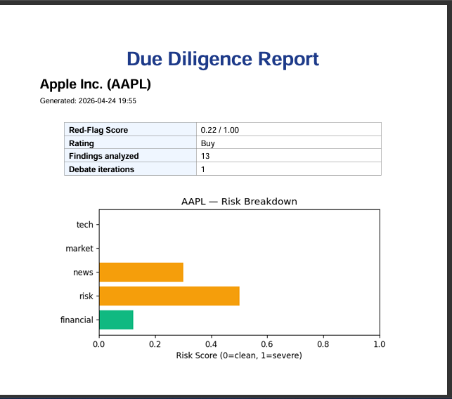
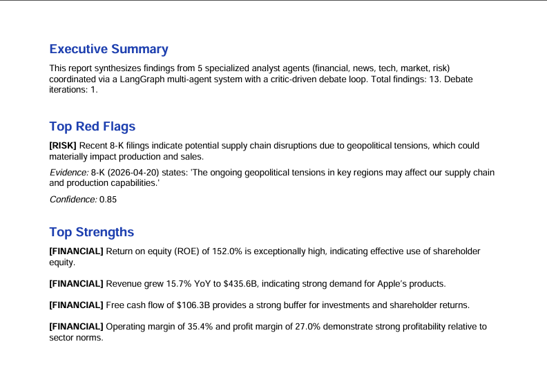
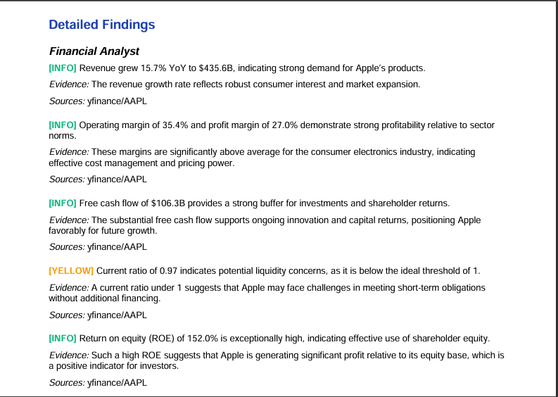

# 🔍 DD-Agent — Autonomous Due Diligence Analyst

> A multi-agent AI system that performs **investment-grade due diligence** on any public company in minutes — not days.

DD-Agent reads SEC filings, scans global news, inspects open-source activity, sizes the market, and stress-tests risks — all in parallel — then debates its own findings with a critic agent before producing a cited PDF report with a quantified red-flag score.

---

## 🎯 What It Does

You give it a company name and ticker (e.g. `Apple Inc.`, `AAPL`).
It returns a **professional due-diligence report** containing:

- ✅ **Red-Flag Score** (0.00 – 1.00) with a per-category breakdown
- ✅ **Buy / Hold / Sell** rating
- ✅ **Top Strengths & Top Red Flags** with evidence and confidence
- ✅ **Detailed findings** from 5 specialist agents, every claim cited
- ✅ **Risk-breakdown chart** across financial, news, tech, market, and risk dimensions
- ✅ **Downloadable PDF** ready to share with an investment committee

---

## 🧠 How It Thinks — Multi-Agent Architecture

DD-Agent is built on **LangGraph** and orchestrates 5 specialist analyst agents in parallel, then loops them through a critic-driven debate until every finding is backed by hard evidence.

architecture.mmd

### The 5 Specialist Agents

| Agent | What it analyzes | Data sources |
|---|---|---|
| 💰 **Financial Analyst** | Revenue, margins, cash flow, ROE, liquidity | yfinance, SEC 10-K |
| 📰 **News Analyst** | Recent events, sentiment, controversies | GDELT, web search |
| 💻 **Tech Analyst** | Engineering velocity, OSS health, hiring signals | GitHub API |
| 📊 **Market Analyst** | TAM, competitors, market position | Web research |
| ⚠️ **Risk Analyst** | Disclosed risk factors, recent 8-K filings | SEC EDGAR |

A **Critic agent** then reviews every finding and forces revisions if evidence is weak — eliminating hallucinations before they reach the report.

---

## 📄 What the Final Report Looks Like

Every run produces a polished, citation-rich PDF.

### 1. Cover Page — Score & Risk Breakdown

### 2. Executive Summary — Top Red Flags & Strengths

### 3. Detailed Findings — Every Claim Cited

---

## ⚡ Tech Stack

- **Orchestration:** LangGraph (stateful multi-agent graphs)
- **LLM:** OpenAI GPT-4-class models
- **Backend API:** FastAPI + async job queue
- **Frontend:** Streamlit
- **Reporting:** ReportLab + Matplotlib
- **Data:** SEC EDGAR · yfinance · GDELT · GitHub API
- **Deployment:** Docker / Docker Compose

---

## 🌟 Why It's Different

- **Evidence-first** — every finding includes the source document, quote, and confidence score
- **Self-critiquing** — a dedicated critic agent loops until findings hold up
- **Explainable scoring** — the red-flag score is decomposed by category, not a black box
- **Parallel by design** — 5 agents run concurrently, cutting analysis time dramatically
- **Production-grade output** — boardroom-ready PDF, not just a chat transcript

---

## 👤 Author

**Ameer Hamza**
📧 ameerhmza547@gmail.com

---

*Built to demonstrate production-grade agentic AI systems: multi-agent orchestration, self-critique loops, structured outputs, and verifiable reasoning.*
